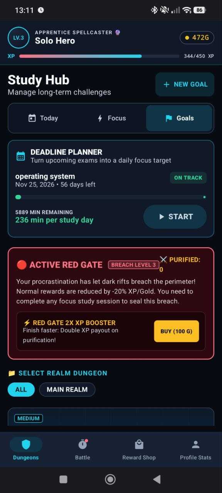
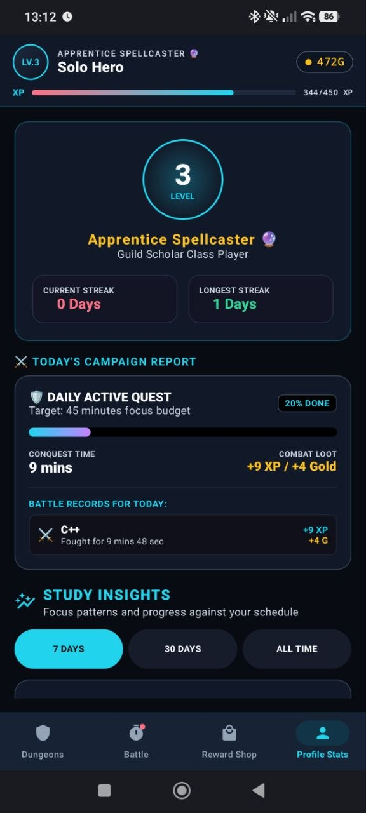
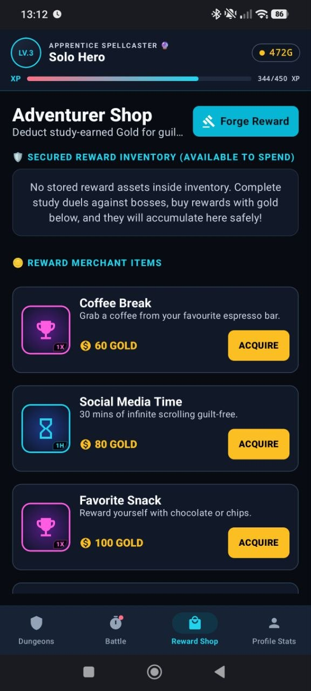

# Solo Studying

Solo Studying is an offline Android study timer that turns learning goals into
RPG-style campaigns. A study session damages a selected boss, earns experience
and gold, and records progress against the skill being trained.

The project is a work in progress. Its current focus is a reliable local-first
gameplay loop rather than accounts, cloud sync, or online services.

## Screenshots

Real-device screenshots from an earlier build, shared by the project author.
They show the existing study hub, profile progress, and reward shop. The new
dungeon study-plan form and progress card are not shown in these captures.

<table>
  <tr>
    <th>Study goals</th>
    <th>Profile &amp; progress</th>
    <th>Reward shop</th>
  </tr>
  <tr>
    <td></td>
    <td></td>
    <td></td>
  </tr>
</table>

## What works

- First-run setup for goals, study days, and daily targets
- Dungeons for grouping related goals
- Course-sized dungeon plans with hour targets, finish dates, custom study days, and adaptive daily estimates
- Boss battles and free-study sessions
- Independent goal sessions with 25/45/60-minute presets, custom durations, and daily-plan suggestions
- Offline guided exam planner with course effort estimates, daily capacity, weekly sessions, progress credit, and confirmed rescheduling
- Weekly course sessions inside Today, with direct start, credited progress, and a confirmed "No time today" rescheduling preview
- One-tap focus presets that remember the last duration and skill
- Personalized daily dashboard with prioritized next actions and target progress
- Home-screen widget for today's progress, next action, streak, and quick focus
- Weekly streak widget with daily target states and an original study companion
- Daily study quests with priorities, rollover, history, and timer integration
- Recurring study quests for daily routines or selected weekdays
- Goal checklists with timed study steps, progress tracking, and automatic completion
- Pause, resume, abandon, and completion flows
- Live focus notifications with countdown, pause, resume, and finish controls
- Post-session summaries for time, rewards, levels, streaks, and progress
- Optional post-session break timers with persistent countdowns and completion alerts
- Weekly, monthly, and lifetime study insights with goal and period comparisons
- Independent skill progression based on focused time
- Custom real-life rewards purchased with earned gold
- Streaks, level progression, and recovery challenges
- Configurable local reminders based on schedule and current progress
- Low-latency sci-fi interface sounds for study and progression feedback
- Persistent sound enable and volume controls
- Local persistence with Room

## Tech stack

- Kotlin
- Jetpack Compose and Material 3
- Room with Kotlin Symbol Processing
- Coroutines, Flow, and StateFlow
- MVVM with feature-specific view models
- AlarmManager and BroadcastReceiver for reminders
- Chronometer-based Android notifications for background focus controls
- Robolectric and JUnit for local tests

The bundled interface sounds come from Kenney's CC0 Interface Sounds pack.
See [`THIRD_PARTY_NOTICES.md`](THIRD_PARTY_NOTICES.md) for the source, license,
and file mapping.

## Architecture

```text
Compose screens
      |
SoloStudyingViewModel
      |
Feature view models (battle, status, dungeon, skill, shop)
      |
SoloStudyingRepository
      |
Room DAO and SQLite database
```

`SoloStudyingViewModel` is the interface used by the Compose layer. It delegates
feature behavior to smaller view models while the repository keeps database
access in one place.

## Run locally

### Requirements

- Android Studio with support for Android Gradle Plugin 9.1
- Android SDK 36.1
- JDK 21 (the JDK bundled with current Android Studio works)
- An emulator or Android device running API 24 or newer

### Setup

1. Clone the repository:

   ```bash
   git clone https://github.com/amkumirab/solo-studying-app.git
   cd solo-studying-app
   ```

2. Open the folder in Android Studio.
3. Allow Gradle to sync and download the declared dependencies.
4. Select the `app` configuration and run it on an emulator or device.

No API key or online account is required. Study data stays in the app's local
Room database.

## Plan a long-term course

Open **Dungeons > Goals**, select a dungeon, then choose **Set study target and
deadline**. Enter total study hours, pick a date (or use the **2 months** shortcut),
and choose your study weekdays. **Plan a dungeon** also lets you start with a new
course name. Assign bosses to that exact dungeon name to record course progress.

The plan card shows total progress, remaining effort, and the suggested pace per
remaining study day. Existing and completed boss progress counts; free study does
not. Editing or removing a plan leaves bosses and their recorded time intact.
See [Dungeon study plans](docs/DUNGEON_STUDY_PLANS.md) for calculation rules.

## Tests

Run the local JVM test suite from Android Studio or the project root.

macOS/Linux:

```bash
bash ./gradlew testDebugUnitTest
```

Windows:

```powershell
.\gradlew.bat testDebugUnitTest
```

The core test suite covers onboarding, persistence, boss progress, rewards,
session summaries, streak behavior, and tutorial completion.

## Build and install a debug APK

On Windows, build the app from the repository root:

```powershell
.\gradlew.bat lintDebug assembleDebug
```

The APK is created at `app/build/outputs/apk/debug/app-debug.apk`. With USB
debugging enabled and the device authorized, install or update it with:

```powershell
adb devices
adb install -r app/build/outputs/apk/debug/app-debug.apk
```

## Repository layout

```text
app/src/main/java/com/amkumirab/solostudying/
├── data/
│   ├── dao/
│   ├── database/
│   ├── entity/
│   └── repository/
├── notification/
├── sound/
└── ui/
    ├── screens/
    ├── theme/
    └── viewmodel/
```

Product rules and implementation boundaries are documented in
[`docs/PRODUCT_OVERVIEW.md`](docs/PRODUCT_OVERVIEW.md).

## Current limitations

- Data is stored on one device; export and sync are not implemented.
- Some Compose screens are still large and will be split into feature files as
  the UI evolves.
- Release signing is intentionally left to the developer's local configuration.

## Next steps

- Split the main Compose screen by feature
- Add data export and restore
- Improve accessibility labels and UI tests
- Record a short walkthrough of the study workflow

## License

Copyright (c) 2026 Amir Ali Mirab Zadeh Ardekani. All rights reserved.

The source code may be downloaded, compiled, installed, and run only for
personal, non-commercial evaluation and testing. Modification, redistribution,
publication, commercial use, and derivative works are not permitted without
prior written permission. See the [Evaluation-Only License](LICENSE) for the
complete terms. This is not an open-source license.
